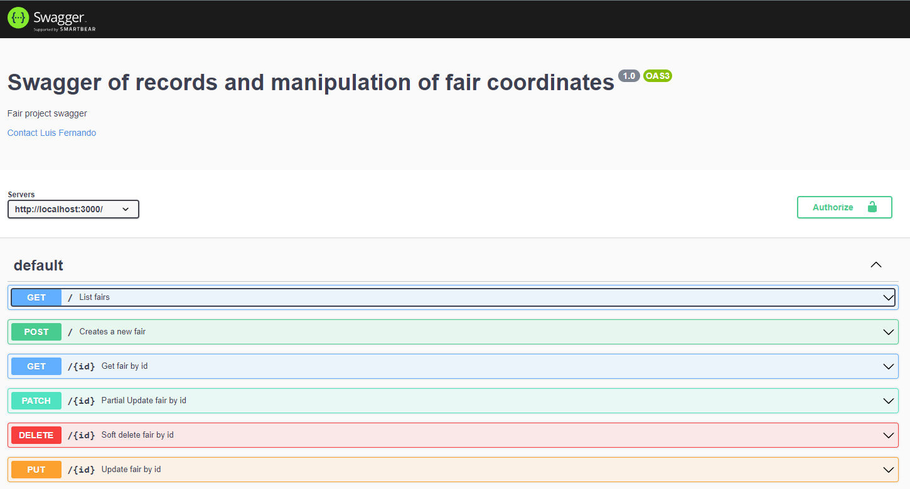

# `Project FAIR`


<!--  -->

## Content Table

<!-- START doctoc generated TOC please keep comment here to allow auto update -->
<!-- DON'T EDIT THIS SECTION, INSTEAD RE-RUN doctoc TO UPDATE -->

- [`Project FAIR`](#project-fair)
  - [Content Table](#content-table)
- [User Instructions](#user-instructions)
    - [Requirements](#requirements)
    - [How to run the server](#how-to-run-the-server)
- [Architecture](#architecture)
    - [Input Validation Layer](#input-validation-layer)
    - [REST API Layer ( Presentation Layer )](#rest-api-layer--presentation-layer-)
    - [Service Layer ( Business Logic Layer )](#service-layer--business-logic-layer-)
    - [Repository Layer](#repository-layer)
    - [Exception Layer](#exception-layer)
    - [Persistence Layer](#persistence-layer)
- [Tests](#tests)
- [Database](#database)
    - [Run Postgres database locally](#run-postgres-database-locally)
    - [Install TypeORM, TypeScript and TS-Node globally](#install-typeorm-typescript-and-ts-node-globally)
    - [Run migrations](#run-migrations)
    - [Run seed database](#run-seed-database)
    - [Create migration file:](#create-migration-file)
    - [Generate Migration when Entity is changed](#generate-migration-when-entity-is-changed)
- [References](#references)
    - [Keep it Short and Simple](#keep-it-short-and-simple)
    - [Tests and Test Driven Development](#tests-and-test-driven-development)
        - [Books:](#books)
        - [Talks:](#talks)
    - [Dependency Injection](#dependency-injection)

<!-- END doctoc generated TOC please keep comment here to allow auto update -->

# User Instructions

### Requirements

In order to run this project you will need to install the LTS version of Node, found at [this link](https://nodejs.org/en/download/)

You will also need to install postgres or a docker-compose compatible version of Docker.

Also, make sure to make a copy of `./environments/.env.local.example` into `./environments/.env.local`

### How to run the server

First of all, run follow command below to install project's dependencies 

```bash
npm install
```
First step, check yours database connections from `docker` or `remote` and put on your credentials on `.env.local`

Second step, you must run command below to create exists migrations tables

```bash
npm run typeorm migration:run
```

Third step, you must run command below to seed database

```bash
npm run seed:local
```

Last step, you can run the server with the following commands:

```bash
npm run start:local
```

You may run test with the following commands:

```bash
npm run test
```

The swagger will be avaliable at: http://localhost:3000/api-docs




# Architecture

The system is structured in different logic layers that have specific responssabilities, highly increasing [cohesion](<https://en.wikipedia.org/wiki/Cohesion_(computer_science)#:~:text=In%20computer%20programming%2C%20cohesion%20refers,inside%20a%20module%20belong%20together.&text=In%20contrast%2C%20low%20cohesion%20is,with%20coupling%2C%20a%20different%20concept.>).
The main goal of this architecture is to provide easy ways of unit testing it's components.
This by itself is responsible for granting the system a lot of qualities in terms of decoupling and manuntenability.

### Input Validation Layer

We are going to validate input through the use of `class-validator` anotations, and middlewares.

Every input shall be represented on request and response package annotated with validation decorators.

Including Http request's body, query and url params.

> A Proof of Concept will be created to test the idea of creating a middleware per controler method, by doing this we will be able to test url params without creating a validation class

### REST API Layer ( Presentation Layer )

In this layer we are going to use _controllers_ to:

- Handle HTTP requests and translate them into data structures that a service can understand.
- Return a response in the appropriate format

Controllers can throw errors directly, they don't need to craft error responses due to the existence of a exception layer.

Every controller has a `.controller.ts` sufix

### Service Layer ( Business Logic Layer )

All business logic is done inside services.

This is the most decoupled layer of the system, as our priority lies in testing this business logic layer to ensure no bugs are present on them.

Services have access to all other services through dependency injection.

Some considerations about services are:

- Services can assume that the input types are correct since they are going to be validated before entering the service
- Every business logic validation that fails or problem that arises should throw an Error directly ( services should not return error objects )

Every service has a `.service.ts` sufix

### Repository Layer

We use this layer to abstract persistent-data access ( in our case, database access ) in such a way that we can mock or replace this layer easily.

We will be using the Repository pattern to do this.

Every repository has a `.repository.ts` sufix

### Exception Layer

We respond to exceptions based on different error codes or exception types that are thrown.

We may define which httpStatus codes we return along with some static data based on what kind of error was thrown.

They should all be classes that extends the `BaseError ` class.

### Persistence Layer

We are going to use `type-orm` to even further abstract the database access in such a way that it's easy to define models and create queries.

Every entity has a `.entity.ts` sufix

# Tests

We will mainly focus on testing Validation classes ( some kinds of DTOs ), services, helpers and controllers.

`.spec.ts`: Unitary tests following a BDD flavour of TDD. ( Tests are written before writing code. )

I strongly suggest you get a tool or plugin that can help you to easily run and visualize the result of tests, as this wil greatly improve your workflow.


# Database

### Run Postgres database locally

```bash
$ docker-compose up
```

### Install TypeORM, TypeScript and TS-Node globally

```bash
$ npm install -g typeorm ts-node typescript
```

### Run migrations

```bash
$ npm run typeorm migration:run

OR

$ npx typeorm migration:run
```

### Run seed database

```bash
$ npm run seed:local
```

### Create migration file:

```bash
$ ts-node node_modules/typeorm/cli.js migration:create -n <MigrationName>

OR

$ npx typeorm migration:create -n <MigrationName>
```

### Generate Migration when Entity is changed

```bash
$ ts-node node_modules/typeorm/cli.js migration:generate -n <MigrationName>

OR

$ ./node_modules/.bin/ts-node ./node_modules/.bin/typeorm migration:generate -n <MigrationName>
```

# References

### Keep it Short and Simple

[Evolving a Clean, Pragmatic Architecture – A Software Crafter’s Guide by Victor Rentea
](https://www.youtube.com/watch?v=tMHO7_RLxgQ)

> A Nice talk that, in it's first part, presents in a very compact way several design principles to build pleasing and pragmatic architectures that are simple and achieves their goals.
> From part II onwards the talk follows a more Java Specific language and talks more about monoliths than small projects, but it is still good,

### Tests and Test Driven Development

##### Books:

[Test-Driven Development by Example - Kent Beck](https://g.co/kgs/RgHQZZ)

> This is a book used by many as a reference when it comes to TDD and it was created by one of the guys that coined the term and invented Extremee Programming.
> I Suggest you reading the preface then skipping to Part III.

##### Talks:

[Effective Unit Testing by Eliotte Rusty Harold
](https://www.youtube.com/watch?v=fr1E9aVnBxw)

> Talks about some characteristics that unit tests should have.

[Victor Rentea - Unit Testing like a Pro: The Circle of Purity
](https://www.youtube.com/watch?v=1Z_h55jMe-M)

> Talks about some architecture characteristics that work in favour of unit testing.

[Why Good Developers Write Bad Tests](https://youtu.be/oO-FMAdjY68)

> Nice presentation that talks about specific differences between test code and production code.

### Dependency Injection

[Wikipedia - Dependency Injection](https://en.wikipedia.org/wiki/Dependency_injection)

> The intent behind dependency injection is to achieve separation of concerns of construction and use of objects. This can increase readability and code reuse.
